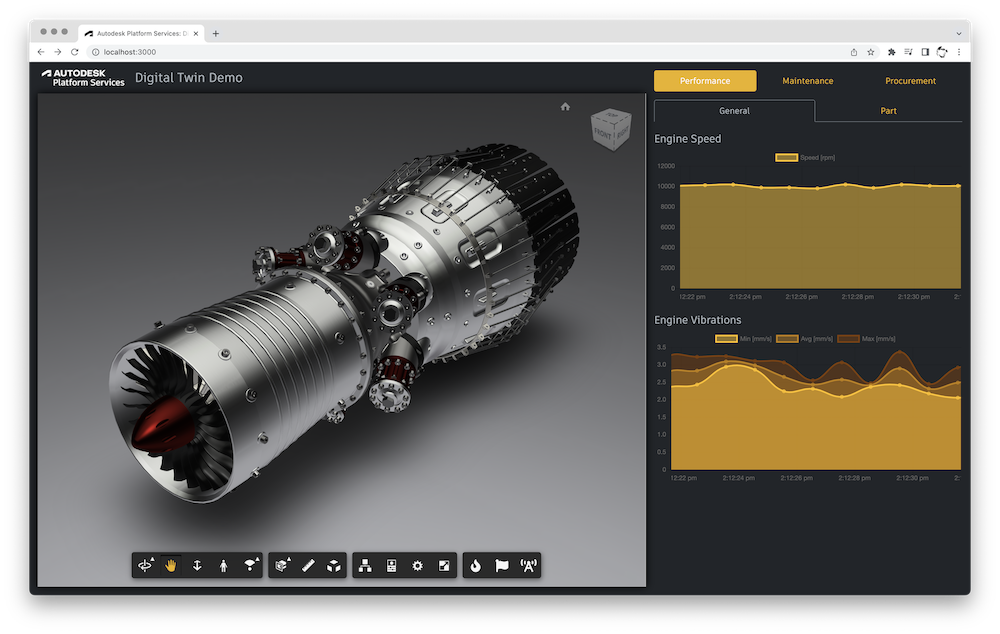

# Digital Twin Demo


[](http://aps.autodesk.com)
[](https://aps.autodesk.com)
[](https://aps.autodesk.com)
[](https://aps.autodesk.com)


[Autodesk Platform Services](https://aps.autodesk.com) application demonstrating various use cases in manufacturing, specifically in context of digital twins.



## Live demo

Master branch is deployed to https://aps-digital-twin.autodesk.io.

## Development

### Prerequisites

- Node.js v10+
- [APS credentials](https://forge.autodesk.com/en/docs/oauth/v2/tutorials/create-app),
  and a _URN_ of a model processed with [Model Derivative APIs](https://forge.autodesk.com/en/docs/model-derivative/v2)
- MongoDB database
  - for example, use the free tier of [MongoDB Atlas](https://www.mongodb.com/cloud/atlas)
  - or run it locally: https://docs.mongodb.com/manual/installation

### Setup

- clone this repository
- install dependencies: `npm install`
- run server with all the required env. variables
  - for example, on macOS:
    ```bash
    export APS_CLIENT_ID=<client-id>
    export APS_CLIENT_SECRET=<client-secret>
    export APS_MODEL_URN=<model-urn>
    export MONGODB_URL=<mongodb-connection-string>
    npm start
    ```
  - or, when using [Visual Studio Code](https://code.visualstudio.com), add this configuration to your _.vscode/launch.json_:
  ```json
        {
            "type": "node",
            "request": "launch",
            "name": "Launch Express Server",
            "program": "${workspaceFolder}/server.js",
            "env": {
                "APS_CLIENT_ID": "<client-id>",
                "APS_CLIENT_SECRET": "<client-secret>",
                "APS_MODEL_URN": "<model-urn>",
                "MONGODB_URL": "<mongodb-connection-string>"
            }
        }
  ```
- go to http://localhost:3000

### Bootstrap theme

The project uses a custom Bootstrap theme. In order to customize it:

- modify _tools/bootstrap-theme/custom.scss_
- run `npm build:client` to update _public/stylesheets/bootstrap.css_
- commit the new version of the CSS file

### Deployment

[](https://heroku.com/deploy)

## Sample data

The jet engine model used in the live demo can be obtained
from https://knowledge.autodesk.com/sites/default/files/file_downloads/Jet_Engine_Model.zip.

## Support

For support, please contact forge.help@autodesk.com.

## License

This sample is licensed under the terms of the [MIT License](https://tldrlegal.com/license/mit-license).
Please refer to [LICENSE](LICENSE) for more details.

## Written by

Petr Broz ([@ipetrbroz](https://twitter.com/ipetrbroz)), Varun Patil, APS Developer Advocates
